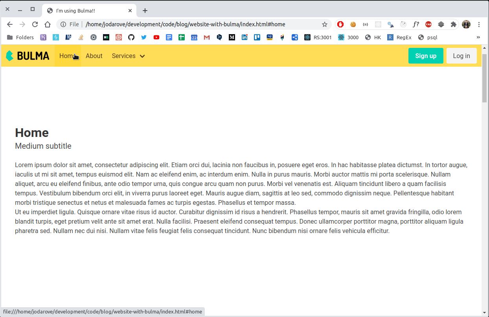

## My first time using bulma framework
- Bulma is a free, open source CSS framework based on Flexbox. [Bulma!](https://bulma.io/)
- This is the repository for the post https://blog.josedromero.com/my-first-time-using-bulma-css-framework
- You can just git clone and then open the index.html in your browser.

